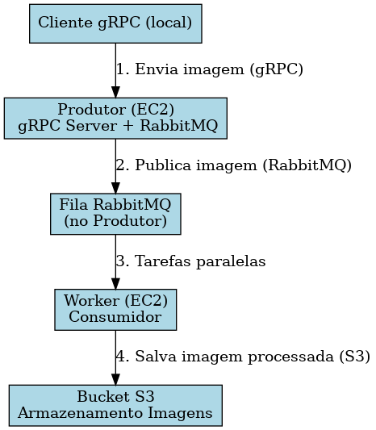

# Relatório Técnico - Sistema Distribuído de Processamento de Imagens em Nuvem

## Introdução e motivação

Este projeto implementa um sistema distribuído na nuvem para processamento de imagens em escala de cinza, utilizando AWS CloudFormation para infraestrutura, gRPC para comunicação entre componentes e RabbitMQ como message broker para paralelismo.

A motivação foi explorar a integração de múltiplas tecnologias modernas (CloudFormation, EC2, S3, gRPC, RabbitMQ) em uma arquitetura escalável e resiliente. O objetivo principal é demonstrar conceitos de comunicação assíncrona, paralelismo e automação de infraestrutura na nuvem.

## Arquitetura proposta

A arquitetura consiste em um serviço Produtor (servidor gRPC) que recebe imagens de um cliente, insere tarefas em uma fila RabbitMQ, e um ou mais Workers que consomem essas tarefas, processam as imagens (convertendo-as para tons de cinza) e salvam o resultado em um Bucket S3.

Todos os recursos de nuvem (VPC, sub-rede, instâncias EC2, etc.) são criados automaticamente via um template CloudFormation na região us-east-1. O par de chaves SSH configurado para acesso às instâncias EC2 chama-se "prova-final".

### Figura 1: Arquitetura do sistema proposto

## Justificativa das escolhas tecnológicas

- **CloudFormation:** para provisionamento automatizado, reprodutível e versionado da infraestrutura.
- **EC2:** instâncias de uso geral, permitindo controle total sobre o ambiente de execução dos componentes.
- **RabbitMQ:** middleware de mensageria robusto que permite comunicação assíncrona e paralela entre produtores e consumidores.
- **gRPC:** protocolo moderno e eficiente, com suporte a comunicação tipada e baixo overhead.
- **S3:** solução de armazenamento escalável e durável, ideal para armazenar os resultados do processamento de imagens.

## Detalhamento da infraestrutura como código

A infraestrutura é definida em um template `template.yaml`, que automatiza a criação dos seguintes recursos:

- **VPC** personalizada com sub-rede pública e Internet Gateway.
- **Route Table** com rota padrão para acesso externo.
- **Security Groups** com regras apropriadas:
  - Porta 50051 aberta para o servidor gRPC.
  - Porta 5672 aberta entre Producer e Worker (RabbitMQ).
  - Porta 22 (SSH) aberta para gerenciamento.
- **Bucket S3** com versionamento habilitado para armazenamento das imagens processadas.
- **Instância EC2 do Producer:** com User Data que instala Docker, inicia RabbitMQ e configura o ambiente Python.
- **Instância EC2 do Worker:** com User Data que instala dependências Python e configura variáveis de ambiente (IP do Producer e nome do Bucket S3). A instância Worker utiliza uma IAM Role com permissão de gravação no S3.

## Descrição da comunicação entre componentes

- **Cliente gRPC:** Aplicação cliente (script Python) executada localmente. Envia uma imagem via chamada gRPC `SendImage` para o servidor remoto.
- **Produtor (EC2):** Servidor gRPC que recebe a imagem e publica uma mensagem com a imagem na fila RabbitMQ local.
- **Fila RabbitMQ:** Middleware que armazena as tarefas de processamento de imagens. Garante desacoplamento entre Producer e Workers.
- **Worker (EC2):** Consumer que consome mensagens da fila, processa as imagens (conversão para tons de cinza) e salva os resultados no S3.
- **Bucket S3:** Armazena as imagens processadas. O Bucket é criado automaticamente pelo CloudFormation e o nome é único.

A comunicação entre Client e Producer é síncrona (gRPC), enquanto a comunicação entre Producer e Workers é assíncrona (RabbitMQ).

## Estratégias de paralelismo e/ou escalabilidade

- O uso do RabbitMQ permite que múltiplos Workers sejam executados em paralelo, lendo da mesma fila e processando tarefas de forma concorrente.
- O sistema pode ser facilmente escalado horizontalmente, bastando iniciar múltiplas instâncias Worker (manualmente ou via Auto Scaling Group).
- A arquitetura desacoplada permite balanceamento de carga natural entre os Workers.

## Testes realizados

- **Testes funcionais:** Envio de diversas imagens de diferentes formatos e tamanhos. As imagens foram corretamente processadas e armazenadas no S3.
- **Testes de concorrência:** Múltiplas imagens enviadas em sequência pelo client. Logs do Worker confirmaram o correto consumo paralelo das tarefas.
- A arquitetura demonstrou robustez e comportamento consistente durante os testes, com logs de confirmação e validação visual das imagens no S3.

## Considerações finais e possíveis melhorias

- A arquitetura atual já cumpre os objetivos propostos e demonstra uma solução completa de processamento distribuído de imagens em nuvem.
- Possíveis melhorias incluem:
  - Adicionar Auto Scaling Groups para os Workers.
  - Implementar Load Balancer e Auto Scaling para o Producer.
  - Incluir métricas e dashboards de monitoramento com CloudWatch.
  - Implementar suporte a formatos de imagem adicionais e pipelines de processamento mais avançados.
  - Adicionar autenticação/segurança para o acesso gRPC.

Este projeto demonstrou com sucesso a integração de diversos serviços AWS e tecnologias de comunicação modernas para a construção de uma aplicação distribuída resiliente, escalável e automatizada.
